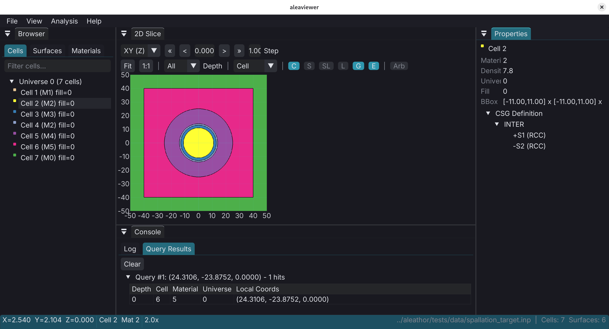

# aleaviewer

A C++17 desktop application for visualizing and analyzing nuclear geometry (MCNP/OpenMC formats) using Constructive Solid Geometry (CSG). Built with [ImGui](https://github.com/ocornut/imgui), SDL2, and OpenGL3.

## Features

- **2D slice viewport** with mouse pan/zoom, cell querying, and overlay layers (grid, contours, surface curves, labels)
- **Geometry browser** for cells, surfaces, and materials with visibility toggles
- **Properties inspector** showing cell/surface details and CSG tree
- **Built-in console** with command history and point query results
- **Format support**: MCNP and OpenMC (load and export)
- **Arbitrary slice planes** with origin/normal/up vector controls
- Color by cell, material, universe, or density

## Screenshot



## Building from source

### Dependencies

| Platform | Packages |
|----------|----------|
| Debian/Ubuntu | `sudo apt install libsdl2-dev libgl-dev g++` |
| Fedora | `sudo dnf install SDL2-devel mesa-libGL-devel gcc-c++` |
| macOS | `brew install sdl2` |

### Build

```bash
git clone --recursive https://github.com/giovanni-mariano/aleaviewer.git
cd aleaviewer

# Build the CSG library (first time or after submodule update)
make libalea

# Build aleaviewer
make
```

The binary is output to `bin/aleaviewer`.

### Pre-built binaries

Pre-built binaries for Linux and macOS are available on the [Releases](https://github.com/giovanni-mariano/aleaviewer/releases) page.

## Usage

```bash
# Launch with a geometry file
bin/aleaviewer path/to/geometry.i

# Launch without a file (use the 'load' command inside the console)
bin/aleaviewer
```

### Keyboard shortcuts

| Key | Action |
|-----|--------|
| `1` / `2` / `3` | Switch to XY / YZ / XZ plane |
| `+` / `-` | Step slice value forward / back |
| `Home` | Zoom to fit |
| `G` | Toggle grid |
| `L` | Toggle labels |
| `C` | Toggle contours |
| `S` | Toggle surface curves |
| `E` | Toggle errors |
| `Ctrl+O` | Open file |
| `Ctrl+Q` | Quit |

## License

This project is licensed under the [Mozilla Public License 2.0](LICENSES/MPL-2.0.txt).

Vendored dependencies:
- [Dear ImGui](https://github.com/ocornut/imgui) - MIT License
- [libalea](https://github.com/giovanni-mariano/libalea.c) - MPL-2.0

This project is [REUSE](https://reuse.software/) compliant.
